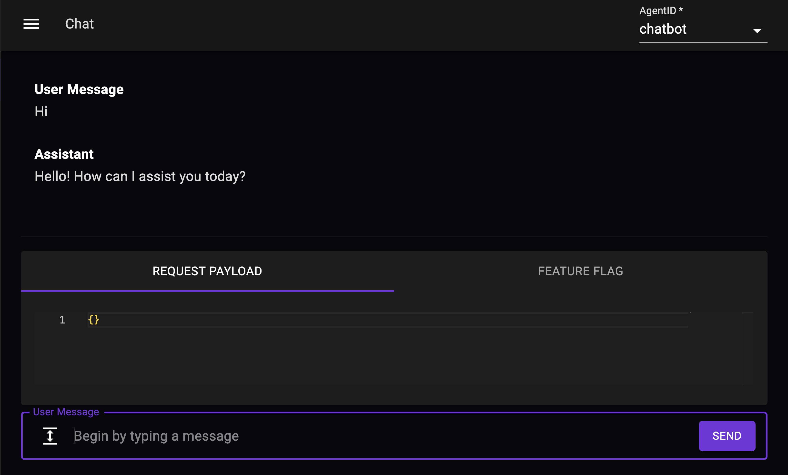

# Agents

Agents are the core building blocks of your Palico App. Agents are just an encapsulation of your LLM application. Agents are generally your prompt logic and a call to your LLM model.

## Building an Agent
To build an agent, you need to create a new directory in the `agents` directory with the agent's name and add an `index.ts` file in it. Next, implement the `LLMAgent` interface and implement the `chat()` method.

```typescript
class ChatbotAgent implements Agent {
  static readonly NAME: string = __dirname.split("/").pop()!;

  async chat(
    content: ConversationRequestContent,
    context: ConversationContext
  ): Promise<LLMAgentResponse> {
    const { userMessage } = content;
    const { conversationId, featureFlags, isNewConversation } = context;
    // Your LLM prompt + model call
    const response = await portkey.chat.completions.create({
      messages: [{ role: 'user', content: 'Hello' }],
      model: 'gpt-4',
    });
    return {
      message: response.choices[0].message.content,
    };
  }
}
```

## Chatting with your Agent
Once you have built your agent and have started your Palico App, you can chat with your agent in the Palico Studio at http://localhost:5173/chat.



## The `LLMAgent` Interface
The `LLMAgent` interface only has the `chat()` method. This method is called when a user sends a message to your agent. The method takes in two parameters:
- `content`: Contains the user message and any other data passed by the caller
- `context`: Contains various context information such as the conversation ID, feature flags, trace ID, and more

#### Content
Content is defined as follows:
```typescript
export interface ConversationRequestContent<Payload> {
  userMessage?: string;
  payload?: Payload;
}
```

#### Context
Context has various properties, such as:
```typescript
export interface ConversationContext {
  conversationId: string;
  requestId: string;
  isNewConversation: boolean;
  featureFlags: Record<string, any>;
}
```
- `conversationId`: A unique identifier for the conversation. A conversation can span multiple messages. Each message in a conversation will have the same `conversationId`.
- `requestId`: A unique identifier for the request. Each message will have a unique `requestId`.
- `isNewConversation`: A boolean indicating if this is the first message in the conversation.
- `featureFlags`: A dictionary of feature flags that can be used to control the behavior of your agent. This is where you define various independent variables for your experiments.

## Connecting to your LLM Agents from external services
Your LLM application is automatically deployed behind an API. You can choose to connect to your LLM Agent from either the REST API, or use our Client SDK. Read more about this in the [Client SDK](./10_sdk.md) section.