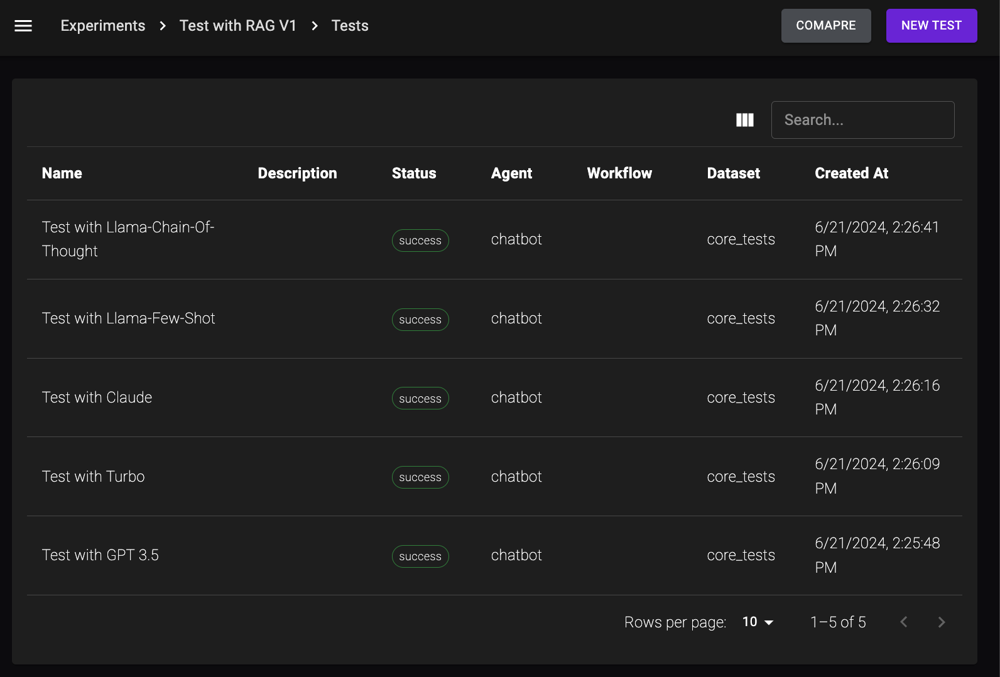

# Palico Studio

Palico Studio is a control panel your entire Palico Application. The goal of this studio is to provide developers a way to manage runtime metrics, help organize experiments, and provide tools to aide in development and debugging.

## Chat UI
Palico Chat UI let's you chat with your LLM Agents or workflows. For a given chat, you can pass in a message, additional data you want to send to your agent, and the feature flags you want to enable for that chat.

## Quick Lab
Quick Lab let's you compare responses from different variations of your LLM Agents. You can compare responses across different agents, or with different feature flags enabled.

## Experiments
The experiment page helps you group, manage, run, and analyze experiments

### Evaluation List

### Evaluation Detail

### Compare across multiple evaluations

## Tracings
We have a dedicated tab that groups recent conversations and allows you to view their traces in Jaeger UI. You also have the ability to view traces directly from QuickLab responses, ChatUI, and evaluation runs.

NOTE: As of right now, traces are saved only in your local environment and are not persisted multiple developers. Traces are meant to be used during development and experiments by the same developer who created them.

### Recent Traces

### Trace Detail
