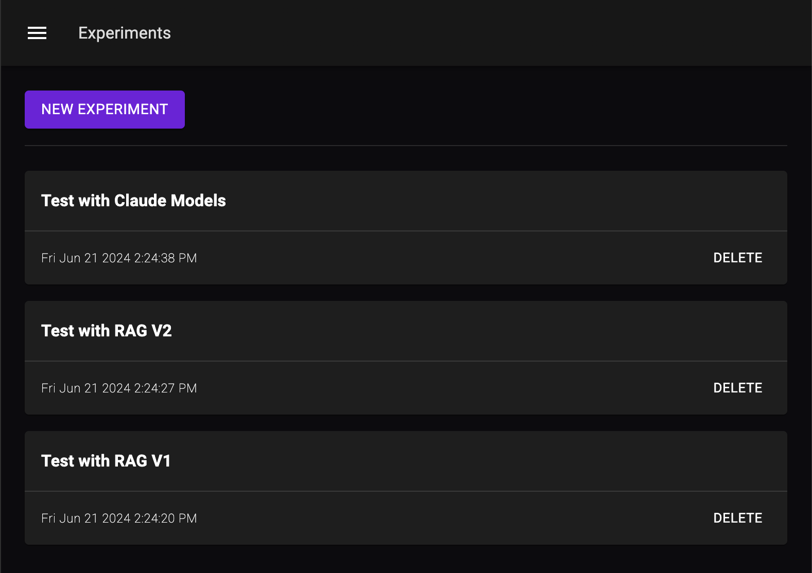

# Overview

It's hard to find the right combination of inputs your LLM model needs (ex. prompt, context, LLM model, etc.) to get the desired output across different use-cases your LLM applications needs to support. The only way to find the right combination is through systematic experimentation where you test your LLM applications with different configurations to see which one works best across all your use-cases.

## Components of an Experiment

### Test Case
A test case contains the input (`userMessage` and `payload`) to an LLM Agent or workflow, a list of tags to help you group and filter the test item, and a list of metrics you want to measure for this test case. Here's an example
```typescript
{
  input: {
    userMessage: "Hello",
    payload: {/* ... */},
  },
  tags: {
    intent: "greeting",
  },
  metrics: [
    new ContainsAnyMetrics({
      substrings: ["Hello", "Hi", "Hey", "Greetings"],
    }),
  ],
}
```

### Metric
A metric is a measurement of the output of your LLM Agent's response. There are two categories of metrics:
- **Objective Metrics**: These are metrics that can be measured objectively. For example, did the response contain a specific keyword, is the response in the correct JSON format, etc.
- **Subjective Metrics**: These are metrics that require human judgment. For example, is the response coherent, is the response friendly, etc. These metrics are often measured using other LLMS or humans.

### Test Suite
A list of test cases that you want to group together. When you run an experiment, you run an evaluation, you run it against a test suite.

### Evaluation
An evaluation is a run of your LLM Agent or workflow against a test suite and a set of feature flags. The output of an evaluation is a evaluated test suite with metrics calculated for each test case.

### Experiment
You run an experiment to test something specific about your LLM Agent or workflow, for example, "How does using OpenAI vs Gemini affect the accuracy of my LLM Agent?" An experiment has a name, a hypothesis, and a list of evaluations you run to test your hypothesis.

## Running an Experiment
### Step 1: Create a Test Suite
This suite is a collect of test-cases you want to run against your LLM Agents to evaluate its accuracy. To create a test suite, create a folder in the `test_suites` directory and add a `index.ts` file in it. Here's an example

```typescript title="src/test_suites/greetings/index.ts"
import {
  ContainsAnyMetrics,
  ContainsMetrics,
  ExperimentTestCaseDataset,
  ValidJSONMetrics,
} from "@palico-ai/app";

const GreetingTests: ExperimentTestCaseDataset[] = [
  {
    input: {
      userMessage: "Hello",
    },
    tags: {
      intent: "greeting",
    },
    metrics: [
      new ContainsAnyMetrics({
        substrings: ["Hello", "Hi", "Hey", "Greetings"],
      }),
    ],
  }
]

export default TestCaseDataset;
```

To see the list of available metrics, or to create your own custom metrics, check the [metrics](./04_metrics.md) documentation.

### Step 2: Create an Experiment

To create an experiment, go to Palico Studio, go to the Experiments Tab, and click Create Experiment. Experiments helps you group related evaluations together.


### Step 3: Run an Evaluation

Evaluation is a run of your LLM Agent or workflow against a test suite and a set of feature flags. To run an evaluation, go to the Experiments Tab, click on the experiment you want to run an evaluation for, and new evaluation. From there, select your agent or workflow, test suites, and feature flag configurations for the evaluation.


### Step 4: Analyze the Results

After an evaluation is completed, you can see the result by clicking on the evaluation. you can also see see the traces by clicking the conversation id icon.

You can compare the results of different evaluations by clicking on the compare button on the evaluation page.

Additionally, all your evaluation results are saved in `src/appdata/experiments` as JSON files. You can import this file into Jupyter Notebook for more in-depth analysis.

## Next Steps