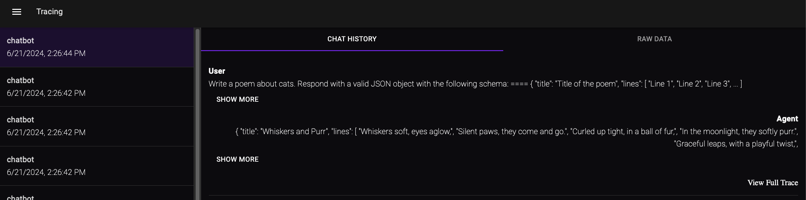
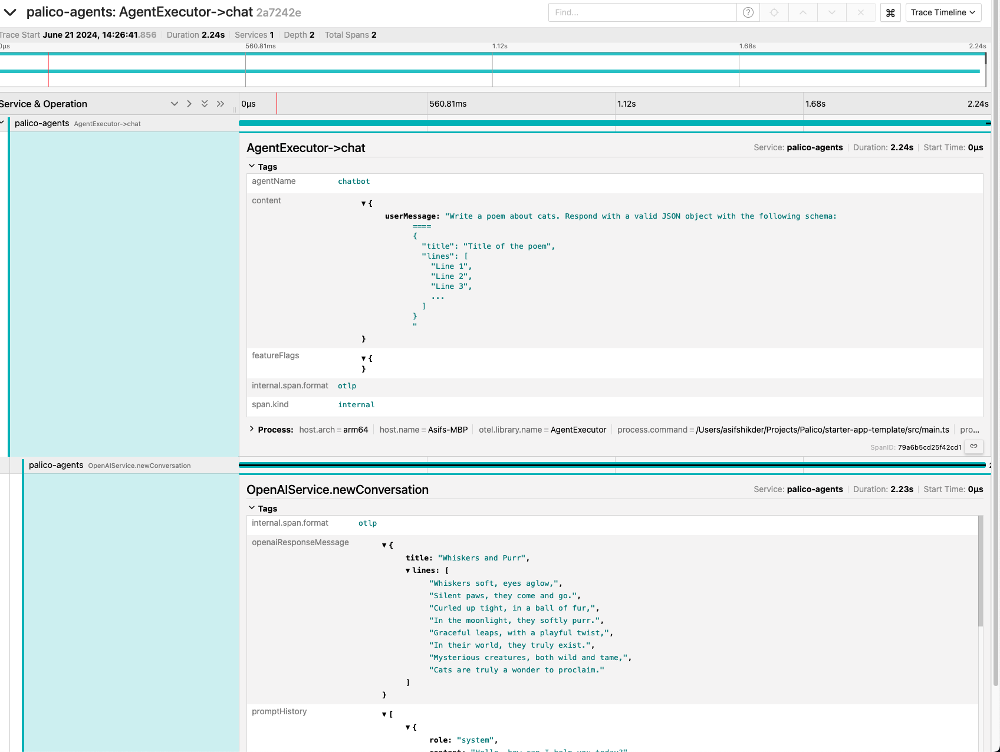

# Tracing

Palico provides tracing with OpenTelemetry. All your traces are sent to Jaeger UI, which you can access at http://localhost:16686 or from the Tracing tab in Palico Studio. Traces are also added throughout the Palico Studio UI where applicable. We provide traces out-of-the-box, but you can also add your own custom traces.

## Adding Custom Traces
You can add custom traces using OpenTelemetry. Here's an example of adding traces to a call from OpenAI API.

```typescript
import { SpanStatusCode, trace } from "@opentelemetry/api";

// highlight-next-line
const tracer = trace.getTracer("OpenAIService");

const newConversation = async (message: string) => {
  // highlight-next-line
  return tracer.startActiveSpan(
    "OpenAIConversation",
    async (span) => {
      span.setAttribute("message", message);
      try {
        const response = await openaiClient.chat.completions.create({
            model: "gpt-3.5-turbo",
            messages: [
              // ... your prompts
            ],
          });;
        const responseMessage = response.choices[0].message.content
        // highlight-next-line
        span.setAttribute("LLM reply", responseMessage)
        return response;
      } catch (error) {
        span.setStatus({ code: SpanStatusCode.ERROR });
        throw error;
      }
    }
  );
};

```

You can read more about adding traces with OpenTelemetry [here](https://opentelemetry.io/docs/languages/js/instrumentation/#acquiring-a-tracer).

## Palico Studio Tracing Tab
Palico Studio provides a tracing tab of all your recent conversations. If a conversation has multiple requests, they are grouped together and have separate traces for each request.



### Trace Details
You can view trace details in the Jaeger UI. Here's an example of a trace in Jaeger UI.
