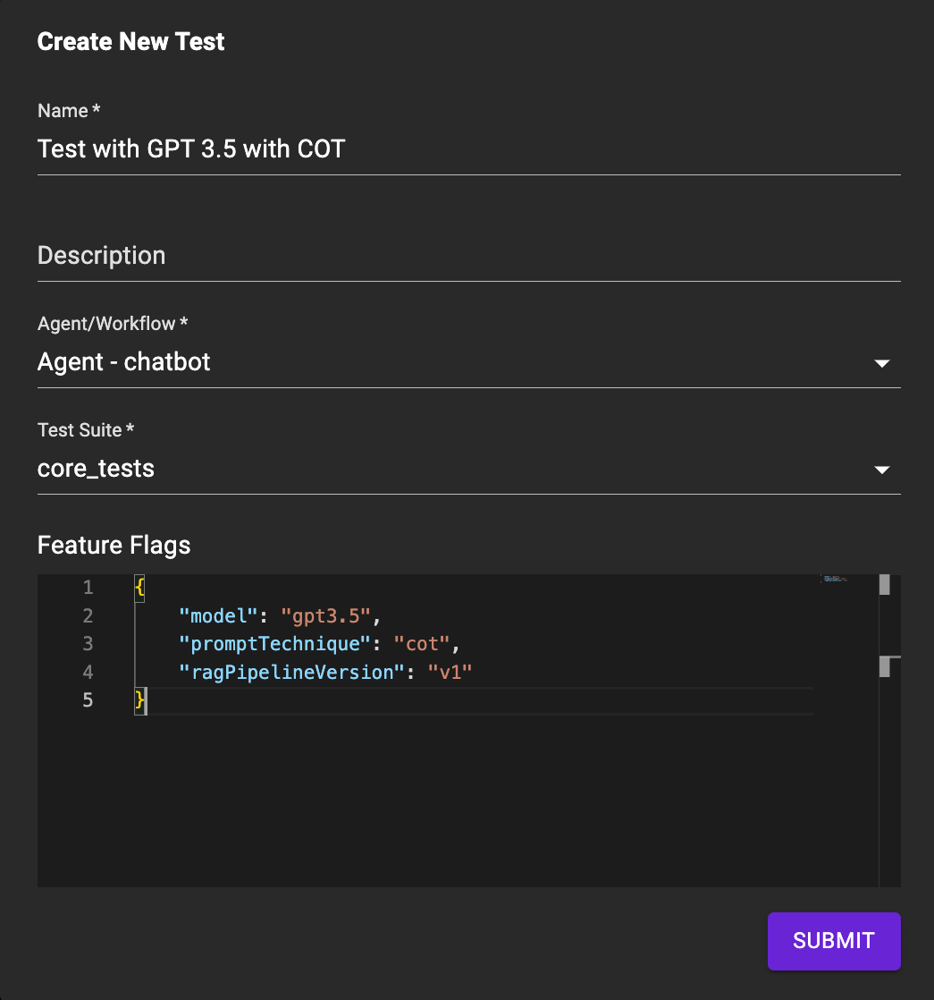

# Improve Performance with Experiments

It's hard to figure out which combination of LLM model, prompts, and business logic results in the best performance for your LLM Application. Your LLM Application needs to work across a variety of use-cases, and relying on intuition (or vibe-check) to pick the right combination of LLM models and Prompts often leads to optimization in one use-case at the cost of another. The best way to find the right combination is to replace intuition with objective metrics that gives you quantifiable performance indicators for your LLM Application. Once you are able to objectively measure the performance of your LLM Application, you can setup an iterative loop to systematically improve it's performance.

## Develop an Iterative Loop
We want to create a development loop that helps you systematically improve the performance of your LLM Application. Here's how the loop looks like:


### Step 1: Create Test Cases
The first step in experiment-driven development is to setup a list of test-cases that models the expected behavior of your LLM application across different use-cases. For a given test case, you want to pass in an input to your LLM system, and measure the output with a quantifiable metric. Here's an example of a test-case:

```typescript
{
  input: {
    userMessage: "Hello",
  },
  tags: {
    intent: "greeting",
  },
  metrics: [
    new ContainsAnyMetrics({
      substrings: ["Hello", "Hi", "Hey", "Greetings"],
    }),
  ],
}
```
In the example above, we are testing that our LLM Agent responds with a greeting when we send it a "Hello" message. We are measuring this with a `ContainsAnyMetrics` metric. You can use the metrics we provide, or create your own custom metrics. There are lots of metrics that are well vetted by researchers that you can use to measure the performance of your LLM Application.

You can learn more about metrics in the [metrics section](#metrics).

### Step 2: Make a Change
The next step is to make a change to your application. This can be changing the LLM model, changing the prompt, changing the context, etc. You can either make these changes directly in the code, but it's often better to use [AppConfig](./03_feature_flag.md) to programmatically make these changes. This way, you can easily compare the performance of different configurations of your LLM Application.

### Step 3: Run an Evaluation
Once you know the change you want to test, for example changing the LLM model from OpenAI to Gemini, you can run an evaluation. An evaluation is a run of your LLM Application against all the test-cases you have defined in your application. The output of an evaluation is a list of test-cases with metrics calculated for each test-case.

You can run evaluations through Palico Studio. Here's an example of running an evaluation:



Ideally you want to run multiple evaluations to test different configurations of your LLM Application. This way you can compare the performance of different configurations of your LLM Application.

### Step 4: Review
Once you have run an evaluation, you can view the metrics for each test-cases in Palico Studio. Here's an example of the evaluation results:


You can also compare different evaluations side-by-side to see how different configurations of your LLM Application perform against each from within Palico Notebook.


You can import multiple evaluations together within this notebook and run various analysis such as filtering, sorting, and grouping to understand the performance of your LLM Application. You can also look at the run-time traces to understand the behavior of your LLM Application.

### Step 5: Deploy
Once you have found the best configuration of your LLM Application, you can deploy it to production. You can use the same AppConfig you used to run evaluations to programmatically deploy your LLM Application. This way you can easily switch between different configurations of your LLM Application in production.

## Metrics
We provide a set of metrics out of the box but you can also create your own custom metrics. Here's a list of metrics we provide:
| Metric Name        | Description                                                    | API Reference                                                                                 |
| ------------------ | -------------------------------------------------------------- | --------------------------------------------------------------------------------------------- |
| ContainsMetrics    | Checks if the response contains the provided substring         | [ContainsMetrics](https://palico-ai.github.io/palico-ai/classes/_palico_ai_app.ContainsMetrics.html)     |
| ContainsAnyMetrics | Checks if the response contains any of the provided substrings | [ContainsAnyMetrics](https://palico-ai.github.io/palico-ai/classes/_palico_ai_app.ContainsAnyMetrics.html) |
| ContainsAllMetrics | Checks if the response contains all of the provided substrings | [ContainsAllMetrics](https://palico-ai.github.io/palico-ai/classes/_palico_ai_app.ContainsAllMetrics.html) |
| ExactMatchMetrics  | Checks if the response is an exact match                       | [ExactMatchMetrics](https://palico-ai.github.io/palico-ai/classes/_palico_ai_app.ExactMatchEvalMetric.html)   |
| ValidJSONMetrics   | Checks if the response is a valid JSON                         | [ValidJSONMetrics](https://palico-ai.github.io/palico-ai/classes/_palico_ai_app.ValidJSONMetrics.html)     |

### System Metrics
You can measure system metrics such as latency, cost, and more. To measure a specific metrics, you need to add the metric to your agent's `response.metadata`. Here's an example tracking total cost:

```typescript
class ExampleAgent implements Agent {

  async chat(
    content: ConversationRequestContent,
    context: ConversationContext
  ): Promise<AgentResponse<AgentResponseData>> {
    const { userMessage } = content;
    const prompt = await this.createPrompt(userMessage);
    const response = await this.openai.chat.completions.create({
      model: model,
      temperature: 0,
      messages: historyDB.messages,
    });
    return {
      message: response.message,
      data: {
        prompt,
      },
      metadata: {
        // highlight-next-line
        [ResponseMetadataKey.TotalCost]: response.usage?.total_tokens
      }
    };
  }
}
```
You can find all the available metadata keys in the [ResponseMetadataKey](https://palico-ai.github.io/palico-ai/enums/_palico_ai_app.ResponseMetadataKey.html) enum.

### Custom Metrics
You can create your own metrics by extending the `EvalMetric` class. Here's an example of creating a custom metric that checks if the response is within a certain length:

```typescript
import { EvalMetric } from "@palico-ai/app";

export class LengthMetrics extends EvalMetric {
  constructor(private min: number, private max: number) {
    super();
  }

  async evaluate(response: string): Promise<number> {
    const length = response.length;
    if (length >= this.min && length <= this.max) {
      return 1;
    }
    return 0;
  }
}
```
