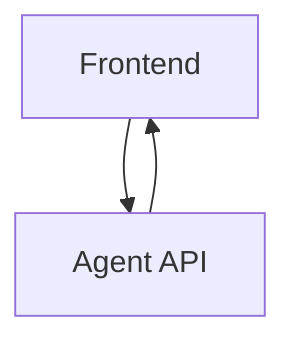
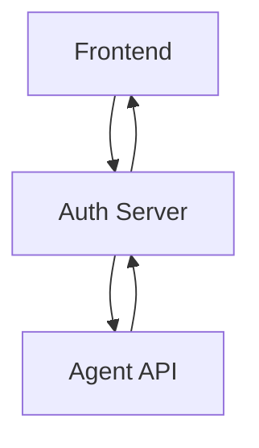

import Tabs from "@theme/Tabs";
import TabItem from "@theme/TabItem";

# Request Authorization

## Introduction

If you want to talk to your Agent, you can either do it directly through the client api (`@palico-ai/client-js`) as shown in the [Create Summarizer | Translator Guide](create_translator), or use the `<PalicoContextProvider />` from the `@palico-ai/react` package as shown in the [Create Copilot Guide](create_copilot).

In both these guides, your frontend is directly talking to the Agent API such:



We want to add a server-sided middleman to authorize requests to the Palico API. This is important to ensure that only the right people can access your Agent.



We can either do this using NextJS server-sided functions, from your own custom backend, or from the Palico Agent API itself.

:::note
This document has various examples of how you can authorize requests to the Palico Agent API. 
Checkout the one that best fits your use case
:::

## Authorize `PalicoContextProvider`

### Using NextJS Server-Sided Functions

#### Step 1: Create an API Route
```ts title="[NextJSApp]/api/palico/route.ts"
import { createProxyAPIAgentRequestHandler } from "@palico-ai/client-js";
import { NextResponse } from "next/server";

export async function POST(req: Request) {
  try {
    const body = await req.json();
    // highlight-next-line
    // Add your auth logic here, such as checking the user's token
    const proxyHandler = createProxyAPIAgentRequestHandler(
      // highlight-next-line
      "http://localhost:8000",
      // highlight-next-line
      "<your-service-key>"
    );
    const response = await proxyHandler(body);
    return NextResponse.json(response);
  } catch (e) {
    console.log(e);
    return new NextResponse("Something went wrong", { status: 500 });
  }
}
```
#### Step 2: Use the API Route
Update your `<PalicoContextProvider />` to use the new API route.
```tsx
import { createNextJSAPIAgentRequestHandler } from '@palico-ai/client-js'

export const CopilotProvider: React.FC<Props> = ({ children }) => {
  return (
      // highlight-next-line
    <PalicoContextProvider requestHandler={createNextJSAPIAgentRequestHandler("/api/palico")}>
      {children}
    </PalicoContextProvider>
  );
};
```

### Authorization using Custom Backend

#### Step 1: Create a post API Route in your backend

We will create a post API route in your backend which will authorize the request and then forward it to the Palico Agent API.
Here's an example of how you can do this in ExpressJS:

```ts title="[YourBackend]"
app.get("/palico", async (req, res) => {
  // handle authorization
  const proxyHandler = createProxyAPIAgentRequestHandler(
    // highlight-next-line
    "http://localhost:8000",
    // highlight-next-line
    "<your-service-key>"
  );
  const response = await proxyHandler(body);
  res.json(response);
});
```

#### Step 2: Define a custom `AgentRequestHandler`

Update your `<PalicoContextProvider />` to use your own custom `AgentRequestHandler`.

```tsx
import { AgentRequestHandler, PalicoContextProvider } from "@palico-ai/react";

// highlight-next-line
const handleAgentRequest: AgentRequestHandler = async (request) => {
  const response = await fetch("<your-api-endpoint>/palico", {
    method: "POST",
    body: JSON.stringify(request),
  });
  return response.json();
};

export const CopilotProvider: React.FC<Props> = ({ children }) => {
  return (
    // highlight-next-line
    <PalicoContextProvider requestHandler={handleAgentRequest}>
      {children}
    </PalicoContextProvider>
  );
};
```

### Authorization in Palico Agent API

:::note
This feature is not yet available
:::

## Authorize `@palico-ai/client-js`
### Using NextJS Server-Sided Functions

#### Step 1: Create an API Route
Instead of calling `createClient` directly in the frontend, it's better to create a NextJS API route that 
calls your agent, and then you can then call this API route from your frontend using `fetch`. Here's an example
of how you can do this:

```ts title="[NextJSApp]/api/palico/new_conversation/route.ts"
import { createProxyAPIAgentRequestHandler } from "@palico-ai/client-js";
import { NextResponse } from "next/server";

export async function POST(req: Request) {
  try {
    const body = await req.json();
    // highlight-next-line
    // Add your auth logic here, such as checking the user's token
    const response = await client.newConversation({
      message: body.message,
      context: body.context,
    });
    return NextResponse.json(response);
  } catch (e) {
    console.log(e);
    return new NextResponse("Something went wrong", { status: 500 });
  }
}
```

#### Step 2: Use the API Route
Update your frontend code to call the new API route. Here's an example of how you can do this:

```tsx
const response = await fetch("/api/palico/new_conversation", {
  method: "POST",
  body: JSON.stringify({
    message: "Hello",
    context: {},
  }),
});
```

### Authorization using Custom Backend
#### Step 1: Create a `POST` API Route in your backend
Instead of calling `createClient` directly in the frontend, create a post route on your custom backend 
that calls the Agent API, and then you can then call this API route from your frontend using `fetch`. 
Here's an example this in ExpressJS:

```ts title="[YourBackend]"
app.get("/palico/new-conversation", async (req, res) => {
  // handle authorization
  const response = await client.newConversation({
    message: "Hello",
    context: {},
  });
  res.json(response);
});
```

#### Step 2: Use the API Route
Update your frontend code to call the new API route. Here's an example of how you can do this:

```tsx
const response = await fetch("<your-api-url>/palico/new-conversation", {
  method: "POST",
  body: JSON.stringify({
    message: "Hello",
    context: {},
  }),
});
```

### Authorization in Palico Agent API

:::note
This feature is not yet available
:::