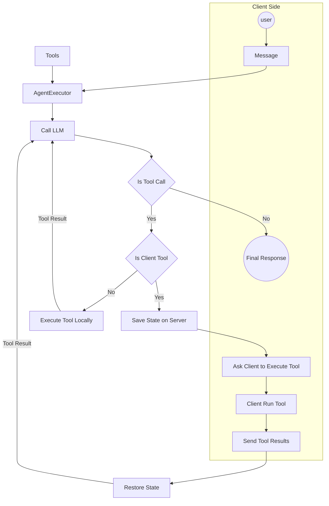

import ClientToolExecutionSnippet from "/snippets/client_sdk/tool_execution.mdx";

## Starter Agent

The starter Palico app from [quickstart](/quickstart) comes with a basic LLM Agent that can fetch weather data with human-in-the-loop confirmation prior to taking action. This agent is a good starting point to understand how Agents works in Palico and we'll use it as a reference to explain different parts of an agent.

The starter agent folder as the following files:

```bash
<project-name>
│── src
│   │── agents
│   │   └── chat_with_tools
│   │       |── agent_executor.ts
│   │       |── openai.ts
│   │       |── tool_executor.ts
│   │       |── tools.ts
│   │       |── types.ts
│   │       |── index.ts
```

## Agent Executor

The `agentExecutor()` function is the "brain" of your agent. It is responsible for:

1. Taking in the current state of the conversation (previous messages + new message)
2. Calling LLM model
3. Running tools if needed.
   - if tool is client-side, pause the execution and ask the client to run the tool
   - if tool is server-side, execute the tool and continue
4. Recursively calling LLM with tool results if needed
5. Returning the final response

Learn more about [Agent Executor Algorithm](#agent-executor-algorithm)

This function is defined in the `agent_executor.ts` file and is called from the `index.ts` file.

```typescript index.ts
const response = await agentExecutor({
  messages: state.messages,
  maxSteps: MAX_STEPS,
  chatCompletion: openaiChatCompletion,
  tools,
  onToolCall: (toolCall) => {
    // callback to run tools
    const resultString = JSON.stringify(toolCall.result);
    // notify the client about the tool call
    stream.push({
      intermediateSteps: [
        {
          name:
            `Function Call: ${toolCall.name}()` +
            (resultString.length > 20 ? "" : ": " + resultString),
          data: {
            input: toolCall.parameters,
            result: toolCall.result,
          },
        },
      ],
    });
  },
});
```

### Input Parameters

<Card>
  <ResponseField name="messages" type="Message">
    The current state of the conversation. This includes all the messages sent
    the LLM model, and the new message sent by the user. Theses messages are
    saved in a database and restored between each request. Learn more about
    [_Message_](#message)
  </ResponseField>
  <ResponseField name="maxSteps" type="number">
    The maximum number of steps the agent can take. This is to prevent infinite
    loops.
  </ResponseField>
  <ResponseField name="chatCompletion" type="ChatCompletion">
    The function that calls the LLM model. By default the starter app uses
    openai but you can use your own function. Learn more about [_Chat
    Completion_](#chat-completion)
  </ResponseField>
  <ResponseField name="tools" type="Tool[]">
    The list of tools that the agent can execute. Learn more about
    [_Tools_](#tools).
  </ResponseField>
  <ResponseField name="onToolCall" type="Function">
    A callback function that is called when a tool is executed. This is used to
    notify the client about the tool call. Learn more about
    [_Streaming_](/guides/streaming)
  </ResponseField>
</Card>

## Tools

The core theme of an agent is it's ability to take actions. In Palico we have two types of tools:

- **Server-side Tools**: These are tools that are executed on the server-side within the runtime of your palico app. For example: fetching data from an API, querying a database, etc.
- **Client-side Tools**: These are tools that are executed on the client-side. For example: human-in-the-loop confirmation, getting user's location, running a script on the client's machine, etc.

The `tools.ts` file contains the definition of these tools. Here's an example of a client-side and a server-side tool.

<Note>
  Note that client-side tools do not have an `execute` function as they are
  executed on the client-side.
</Note>

```typescript tools.ts
export const tools: Tool<any, any>[] = [
  // server-side tool: get weather information
  {
    name: "getWeatherInformation",
    description:
      "show the weather in a given city to the user. " +
      "Always ask run askForConfirmation() before running this tool.",
    parameters: z.object({ city: z.string() }),
    execute: async ({}: { city: string }) => {
      // fetch weather information from an API
      return {
        outlook: "...",
      };
    },
  },
  // client-side tool: ask for human confirmation
  {
    name: "askForConfirmation",
    description: "Ask the user for confirmation",
    parameters: z.object({
      message: z.string().describe("The message to ask for confirmation."),
    }),
  },
];
```

You can modify the `tools.ts` file to add more tools to your agent.

## Client-Side Tool Execution

Sometimes you need to run actions on the client-side. For example, you might want to ask for human confirmation before taking an action. This can be done by returning a `toolCall` response from your `Chat` function from your palico-app.

```typescript chat_with_tools/index.ts
const handler: Chat = async (params) => {
  // if not a new conversation, restore state
  // call agent executor with state + user input
  // requires client-side tool execution
  // save state and return tool call
  return {
    toolCalls: [{
      id: "---",
      name: "askForConfirmation",
      parameters: { message: "Would you like to execute the weather API?" },
    },
  }];
};
```

From the client-side, you can run the tool and send the results back to the server. Here's simple example of how you can use palico's react library to run tool on a NextJS app.

```tsx
const WeatherApp: React.FC = () => {
  const { messages, pendingToolCalls, sendMessage, addResult, loading } =
    useChat({
      apiURL: "/api/palico",
      agentName: "chat_with_tools",
    });

  const { showDialogConfirmation } = useDialog();

  if (pendingToolCalls.length > 0) {
    const toolCall = pendingToolCalls[0];
    if (toolCall.name === "askForConfirmation") {
      showDialogConfirmation({
        title: "Confirmation",
        message: toolCall.parameters.message,
        onConfirm: async () => {
          addResult(toolCall.id, true);
        },
        onCancel: async () => {
          addResult(toolCall.id, false);
        },
      });
    }
  }

  return (
    //... render messages and input
  )
};
```

Learn more about [Client-SDK](/client-sdk)

## State Management

A conversation with an agent can span multiple messages and tool executions between client and server. For example, if during the execution of your agent you need to ask for human confirmation, you need to save the state of the conversation and restore it when the client sends the confirmation. You can manage these states without managing any storage infrastructure using Palico's [state management tools](/guides/conversation_state).

Here's an example of how you can manage state in your agent across multiple messages.

```typescript chat_with_tools/index.ts
import {
  Chat,
  getConversationState,
  setConversationState,
} from "@palico-ai/app";

const handler: Chat = async (params) => {
  const state = createOrRestoreState(params);
  // call agent executor with current state
  // requires client-side tool execution?
  const newState = {
    // old state,
    // actions taken in agent executor
  };
  await setConversationState(params.conversationId, newState);
  return {
    // ...response
  };
};

const createOrRestoreState = async (params: ChatRequest): Promise<State> => {
  const { toolCallResults, userMessage, isNewConversation, conversationId } =
    params;
  let state: State;
  if (isNewConversation) {
    state = {
      messages: [],
    };
  } else {
    state = await getConversationState<State>(conversationId);
  }
  if (userMessage) {
    state.messages.push({
      role: "user",
      content: userMessage,
    });
  }
  if (toolCallResults) {
    toolCallResults.forEach((toolCallResult) => {
      state.messages.push({
        role: "tool",
        toolCallResult,
      });
    });
  }
  return state;
};
```

## Learn More

Deep-dive into components of an agent

### Types

These are common types used in the starter agent.

#### Message

`Message` is a structured way define requests that are sent to an LLM model across different request in a conversation. We save these messages between requests. It contains the following fields:

<ResponseField name="role" type="string" required>
  The sender of the message. This can be: "system" | "user" | "tool" |
  "assistant"
</ResponseField>
<ResponseField name="content" type="string" required>
  The content of the message. For system or user, this is often just a text
</ResponseField>
<ResponseField name="toolCalls" type="ToolCall" required>
  If the role "assistant" requires a tool to be executed, this field contains
  the tool call information.
</ResponseField>
<ResponseField name="toolCallResult" type="ToolCallResult" required>
  If the role "tool" is a response to a tool call, this field contains the
  result of the tool call.
</ResponseField>

#### Chat Completion

`ChatCompletionFunction` represents a function that:

1. Takes in `Message[]` and `Tool[]` as input
2. Calls an LLM model
3. Returns a `Message` response from the LLM model.

The starter app comes with an openai chat completion function, but developers can use their own chat completion function. The function signature is as follows:

```typescript
type ChatCompletionFunction = (
  messages: Message[],
  tools: Tool[]
) => Promise<Message>;
```

### Agent Executor Algorithm


